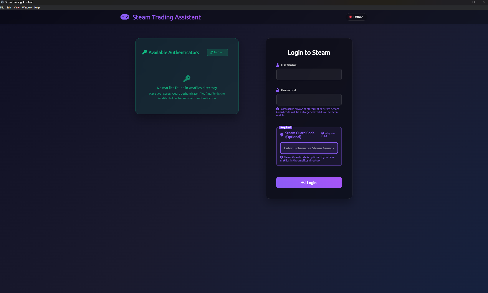
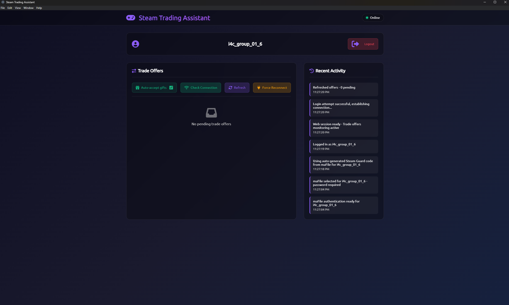

# Steam Trade Handler - Electron App

A beautiful, modern Electron application that handles Steam trade offers with an intuitive graphical interface.

<a href="https://buymeacoffee.com/jorgermduarte" target="_blank"></a>

## Features

- 🎨 **Beautiful Modern UI** - Dark theme with glassmorphism effects
- 🔐 **Secure Steam Login** - Supports username/password and Steam Guard
- 📱 **Real-time Monitoring** - Automatically detects new trade offers
- 🎁 **Gift Auto-accept** - Automatically accepts gift offers
- ✅ **Easy Management** - Accept/decline offers with one click
- 📊 **Activity Logging** - Track all trade activities in real-time
- 🔄 **Auto-session Renewal** - Handles Steam session expiration automatically
- 📱 **Responsive Design** - Works on desktop and mobile devices

## Screenshots

The app features:
- **Login Screen**: Clean Steam authentication interface



- **Dashboard**: Real-time trade offers and activity monitoring



## Installation

1. **Install Dependencies**
   ```bash
   npm install
   ```

2. **Start the App**
   ```bash
   npm start
   ```

---

**Note**: This app requires a Steam account and follows Steam's terms of service. Use responsibly and in accordance with Steam's policies.

